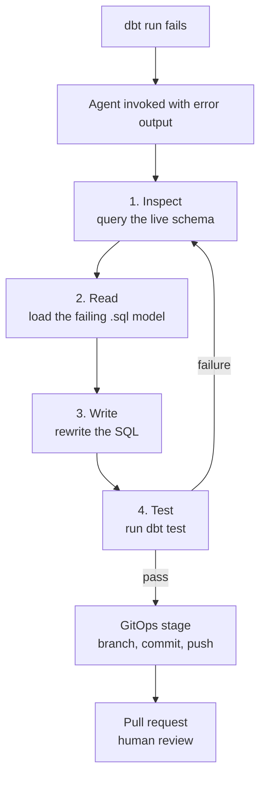
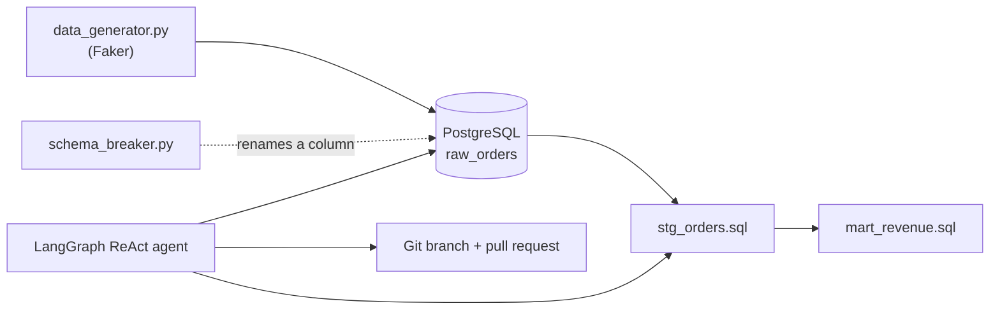

<div align="center">
   


> An autonomous AI agent that detects, diagnoses, and repairs upstream schema drift
> in a dbt warehouse — then opens a pull request and waits for a human.
</div>

## Overview

Analytics pipelines fail in boring, predictable ways. A source system renames a
column. An API adds a required field. An upstream team ships a "small cleanup" on
a Friday. The dbt model downstream still references the old name, the nightly run
turns red, and a human gets paged to perform the same four-step dance they have
done a hundred times: read the error, check the schema, patch the SQL, rerun the
tests.

This project asks a simple question: if the remediation loop is that mechanical,
why is a human still in it?

**Self-Healing Data Pipeline** is a local, fully reproducible demonstration of
autonomous data-ops. It pairs a small but real analytics stack — PostgreSQL, dbt
models with tests, Airflow — with a [LangGraph](https://github.com/langchain-ai/langgraph)
ReAct agent equipped with tools to inspect the live database, read and rewrite
model files, and execute the dbt test suite. A saboteur script deliberately
introduces upstream schema drift; the agent diagnoses the failure, repairs the
model, empirically verifies the fix, and delivers it through a standard GitOps
workflow — branch, commit, pull request. A human only reviews.

Everything runs locally in Docker. One script breaks the pipeline on purpose,
then lets the agent heal it.

## Quick Start

After completing [Setup and Installation](#setup-and-installation):

```bash
docker compose up -d
export OPENAI_API_KEY="your_api_key_here"
python demo.py
```

## Table of Contents

- [The Problem](#the-problem)
- [The Demonstration Scenario](#the-demonstration-scenario)
- [The Agent Loop](#the-agent-loop)
- [Architecture](#architecture)
- [The Agent Toolkit](#the-agent-toolkit)
- [Project Structure](#project-structure)
- [Prerequisites](#prerequisites)
- [Setup and Installation](#setup-and-installation)
- [Usage](#usage)
- [Reviewing the Fix](#reviewing-the-fix)
- [Engineering Decisions](#engineering-decisions)
- [Limitations and Scope](#limitations-and-scope)
- [Roadmap](#roadmap)
- [Contributing](#contributing)
- [License](#license)

## The Problem

Schema drift is the routine failure mode of every analytics stack that consumes
external systems. Today, the standard response looks like this:

| Stage | Traditional response | This project |
| --- | --- | --- |
| Detection | An engineer notices a failed run | The pipeline failure triggers the agent |
| Diagnosis | Manual: read logs, query the schema | The agent queries the live schema itself |
| Fix | Hand-edited SQL | The agent rewrites the model SQL |
| Verification | Rerun the job and hope | The agent runs dbt tests in a loop until green |
| Delivery | Manually opened PR | The agent opens the PR; a human merges it |

The goal is not to remove humans from the loop — it is to remove humans from the
*tedium* of the loop, and to keep them exactly where judgment belongs: reviewing
the diff.

## The Demonstration Scenario

The repository ships with one concrete failure story, end to end:

1. `init.sql` creates the `raw_orders` table. `data_generator.py` (Faker) loads
   mock rows containing an `order_amount` column.
2. `dbt run` builds `stg_orders` and `mart_revenue`. All tests pass.
3. `schema_breaker.py` executes
   `ALTER TABLE raw_orders RENAME COLUMN order_amount TO total_amount;` —
   simulating an upstream team shipping a breaking change.
4. The next dbt run fails with:
   `column "order_amount" does not exist`.
5. `agent.py` invokes the LangGraph ReAct agent, which enters the repair loop
   described below.
6. The agent converges on the minimal fix — aliasing the new column back to the
   contract downstream models expect (`SELECT total_amount AS order_amount`) —
   verifies it with the dbt test suite, and pushes a branch for review.

## The Agent Loop

When the pipeline breaks, the agent is invoked with the dbt error output and
cycles through four stages:

1. **Inspect** — Reads the failing dbt run's error output and queries the live
   database catalog (the actual columns on `raw_orders` right now), grounding
   its diagnosis in real schema state rather than in the error message alone.
2. **Read** — Loads the failing `.sql` file from the local filesystem to
   understand what the model expects.
3. **Write** — Rewrites the SQL to reconcile the mismatch, for example aliasing
   the new column name back to the expected one
   (`SELECT total_amount AS order_amount`).
4. **Test** — Runs `dbt test` against the change. A failure sends the agent back
   to **Inspect**; a pass moves the workflow forward to the GitOps stage.

Once tests pass, the GitOps stage takes over: the agent creates an isolated
branch, commits the verified fix, pushes it, and opens a Pull Request for human
review.

This loop is what separates the system from a simple find-and-replace script:
the agent reasons over real error output and real schema state, and it only
stops once its fix is empirically verified.



## Architecture



| Component | Role |
| --- | --- |
| PostgreSQL (Docker) | The warehouse holding `raw_orders` and the dbt-built models |
| dbt | The transformation layer: staging and marts models with tests |
| Airflow (Docker) | The orchestration plane of the running stack; the custom image includes dbt |
| `data_generator.py` | Produces realistic mock order rows with Faker |
| `schema_breaker.py` | The saboteur: simulates upstream schema drift |
| `agent_tools.py` | The tool layer between the LLM and the system |
| `agent.py` | LangGraph ReAct agent initialization and the repair loop |
| `demo.py` | One-click orchestrator for the full break/fix cycle |
| Git / GitHub | Delivery plane: the agent commits to an isolated branch and opens a PR |

The agent talks to any OpenAI-compatible endpoint (OpenAI, Groq, Zhipu AI, or
similar), so the reasoning engine is swappable without touching the tool layer.

## The Agent Toolkit

The agent does not run free-form shell commands. Every action passes through a
narrow, auditable set of Python functions in `src/agent_tools.py`:

| Capability | What it does |
| --- | --- |
| Inspect the live schema | Queries the database catalog so the agent sees what columns exist now, not what the error claims |
| Read a model file | Loads a model's `.sql` from disk into the agent's context |
| Write a model file | Persists the agent's rewritten SQL to disk |
| Run dbt (build / tests) | Executes the dbt suite and returns the raw output — the agent's ground truth for success or failure |
| Git operations | Branch, commit, and push the verified fix |

Because all reach flows through these functions, the blast radius is bounded:
the agent can touch model files and feature branches, but the database schema
itself and `main` remain off-limits.

## Project Structure

```text
self-healing-pipeline/
├── docker-compose.yml       # Docker services for Postgres and Airflow
├── Dockerfile                # Custom Airflow image with dbt installed
├── requirements.txt          # Python dependencies
├── demo.py                   # One-click script to run the full break/fix cycle
├── init/
│   └── init.sql               # Postgres initialization script (creates raw table)
├── src/
│   ├── data_generator.py      # Generates mock data using Faker
│   ├── schema_breaker.py      # Simulates upstream schema drift
│   ├── agent_tools.py         # Python functions the AI uses to interact with the system
│   └── agent.py                # LangGraph ReAct agent initialization and execution
└── dbt_project/
    ├── dbt_project.yml        # dbt configuration
    ├── profiles.yml            # dbt database connection profile
    └── models/
        ├── staging/
        │   ├── stg_orders.sql  # Target model for AI fixes
        │   └── schema.yml      # dbt tests
        └── marts/
            └── mart_revenue.sql
```

## Prerequisites

- Docker and Docker Compose
- Python 3.10+ and `venv`
- Git (the agent commits and pushes to a branch; a configured remote is
  optional if you prefer to keep the fix local)
- An OpenAI-compatible API key (OpenAI, Groq, Zhipu AI, or similar)

## Setup and Installation

### 1. Environment Configuration

Clone the repository and create a `.env` file in the root directory:

```env
POSTGRES_USER=admin
POSTGRES_PASSWORD=your_secure_password
POSTGRES_DB=my_db
AIRFLOW_UID=1000
OPENAI_API_KEY=your_api_key_here
```

### 2. Python Environment

Create and activate a virtual environment, then install dependencies:

```bash
python -m venv venv
source venv/bin/activate
pip install -r requirements.txt
```

### 3. Infrastructure Setup

Start the PostgreSQL and Airflow containers. The `init.sql` script
automatically creates the `raw_orders` table on first startup.

```bash
docker compose up -d
```

### 4. dbt Configuration

Ensure `dbt_project/profiles.yml` points to your local Docker container:

```yaml
dbt_project:
  outputs:
    dev:
      type: postgres
      host: localhost
      user: admin
      password: your_secure_password
      port: 5432
      dbname: my_db
      schema: public
      threads: 1
  target: dev
```

## Usage

### Running the One-Click Demo

The `demo.py` script automates the entire cycle: it resets the environment,
generates data, runs dbt, sabotages the schema, and triggers the AI agent.

```bash
export OPENAI_API_KEY="your_api_key_here"
python demo.py
```

### Expected Output

1. The script resets `stg_orders.sql` to its clean state.
2. Docker containers are wiped and rebuilt to ensure a pristine database.
3. Mock data is generated and the initial dbt run passes cleanly.
4. `schema_breaker.py` alters the database schema, simulating upstream drift.
5. `agent.py` executes: the agent reasons aloud, inspects the database,
   rewrites the SQL, and reruns the tests.
6. Upon success, the agent creates a Git branch and pushes the fix.

### A Sample Agent Session

Abridged and illustrative — exact wording varies by model and run:

```text
$ python demo.py

[5/6] Sabotaging schema ...
      ALTER TABLE raw_orders RENAME COLUMN order_amount TO total_amount
      dbt run ... FAIL: column "order_amount" does not exist

[6/6] Invoking agent ...

  [agent] The dbt error says column "order_amount" does not exist in
           raw_orders. I will inspect the live schema to confirm what
           columns exist now.

  [tool]   inspect_schema("raw_orders")
           -> id, customer_name, order_date, total_amount, order_status

  [agent] The column was renamed from order_amount to total_amount
           upstream. Downstream models expect order_amount, so I will
           alias it back to keep the contract stable.

  [tool]   write_model_file("stg_orders.sql",
             "SELECT ..., total_amount AS order_amount, ...")

  [tool]   run_dbt_tests()
           -> PASS: all tests green

  [agent] All tests pass. Creating branch
           agent-fix/stg_orders-20250114-093112, committing the fix,
           and pushing it for review.

[done] Fix delivered via pull request.
```

## Reviewing the Fix

After the script completes, check your local Git branches or your GitHub
repository. The agent will have pushed a branch named similarly to:

```text
agent-fix/stg_orders-<timestamp>
```

Open the associated Pull Request to review the AI-generated SQL fix, its
reasoning trail, and the passing test output before merging.

## Engineering Decisions

**LangGraph for cyclical logic.** Standard LLM chains are linear and cannot
recover from their own mistakes. Data engineering fixes are inherently
iterative — LangGraph lets the agent loop: if `run_dbt_tests` fails, the agent
reads the new error, returns to the rewrite phase, and tries again until it
converges on a working fix.

**Idempotent infrastructure.** `demo.py` runs `docker compose down -v` to fully
wipe the database volume on every execution. This guarantees zero state drift
between runs, so the saboteur always breaks a known-clean schema and every demo
run is reproducible.

**Human-in-the-loop (HITL).** The agent never pushes directly to `main`. It
commits to an isolated branch and opens a Pull Request instead, following
standard enterprise GitOps practice — a human always reviews the agent's
reasoning and diff before it can affect production data.

**A real stack, not a simulation.** The agent's tools issue genuine dbt
commands, real SQL queries, and real Git operations. Nothing about the failure
or the fix is role-played — the schema is actually broken, and the tests
actually pass at the end — which is what makes the loop's convergence
meaningful rather than theatrical.

## Limitations and Scope

This is a demonstration, and it is honest about being one:

- The shipped scenario covers a single drift class (a column rename). The
  [roadmap](#roadmap) covers broader scenarios.
- Fix quality depends on the underlying model; the loop bounds but does not
  eliminate bad attempts.
- Each loop iteration costs an LLM API call.
- The HITL gate is mandatory by design — the agent proposes, humans dispose.

## Roadmap

Ideas for extending this project further:

- Support for additional drift scenarios beyond column renames (type changes,
  dropped columns, new required fields)
- Slack or email notifications when the agent opens a Pull Request
- A dashboard visualizing the agent's reasoning trail and historical fix
  success rate
- Support for additional warehouses beyond PostgreSQL (Snowflake, BigQuery)

## Contributing

Pull requests are welcome. If you extend the drift scenarios or the agent's
toolkit, please run `demo.py` end to end and include the agent's transcript in
your PR description so reviewers can see the loop converge.


<div align="center">

Thanks for stopping by 

</div>
